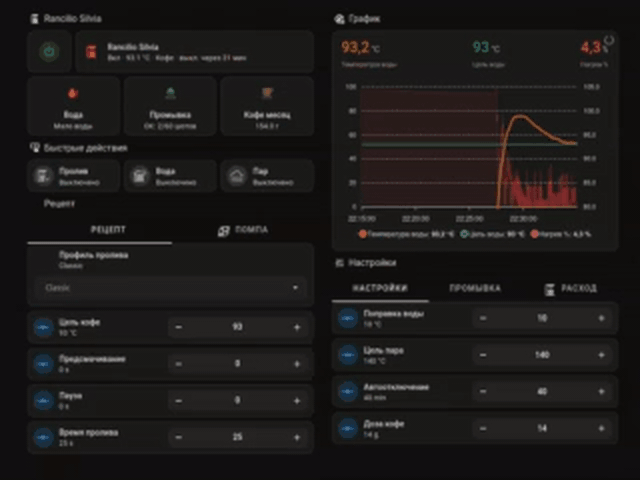

# Rancilio Silvia Controller

Digital controller for the Rancilio Silvia, built with ESP32-S3 and ESPHome: stable temperature, closed-loop pressure control, brew profiles, and Home Assistant integration.

[Русская версия](README.ru.md) · [Telegram project group](https://t.me/Rancilio_Silvia)

> [!WARNING]
> An espresso machine contains hazardous mains voltage, hot water, and a pressurized boiler. This controller does not replace the original thermostat, thermal fuse, protective earth, or any other hardware safety device. Never work on the machine while it is connected to mains power.



https://github.com/user-attachments/assets/92bf4580-1ab9-4535-a1f1-395bb5a3d315

## What It Is

The project moves the main Rancilio Silvia controls to an ESP32-S3:

- a PT100 measures boiler temperature;
- an SSR controls the heater;
- a pressure sensor measures actual brew pressure;
- an AC dimmer controls vibration-pump power;
- relays control machine power, the pump, and the brew valve;
- original panel switches become safe low-voltage inputs;
- Home Assistant exposes machine status and settings.

The controller runs on a real Rancilio Silvia. The current hardware remains a prototype built around an ESP32-S3 development board.

## Key Features

### Temperature Control Without Large Warm-up Overshoot

PID controls the heater through an SSR and maintains separate brew and steam targets.

During a cold start, the integral term is restricted so it cannot accumulate excessive heater demand and push the boiler far beyond its target. Full precision control takes over near the setpoint.

In a measured warm-up from `52.8 °C` to a `93 °C` target, the maximum temperature was `93.79 °C`. The previous conventional PID behavior reached `99.58 °C` under a comparable test.

During brewing, the heater receives a dynamic feed-forward contribution based on pump power, pressure, and temperature. It automatically changes with the estimated incoming cold-water flow.

### Adaptive Pressure Control

Brew profiles define pressure targets rather than fixed pump power. Every `200 ms`, the controller considers:

- measured pressure;
- pressure rise rate;
- estimated time to target;
- current pump power;
- resistance of the current coffee puck.

Incremental PI adjusts pump drive from its present value instead of continuously relying on a guessed pump-power formula. When pressure rises quickly, the controller predicts the approach to target and brakes the pump early to reduce startup overshoot.

If pressure feedback becomes stale or invalid, the automatic pump command is forced to zero.

### Soft Pump Start

Each shot can begin with configurable `Soft Infusion`:

- default starting pump power is `20%`;
- soft-ramp duration is adjustable from `0` to `5 seconds`;
- `0 seconds` disables it;
- the ramp is part of total shot time and does not extend the recipe.

Allowed pump power rises smoothly, but the pump is not required to reach 100%. If pressure is already rising fast enough, adaptive control stops the ramp earlier.

Soft Infusion is a common gentle-start envelope for every profile. Profile preinfusion remains a separate recipe stage that defines the actual wetting pressure and duration.

## Brew Profiles

- **Classic** — constant brew pressure.
- **Lever** — gentle pressure rise followed by a gradual decline.
- **Slayer Style** — long low-pressure preinfusion and a softer main extraction.
- **Bloom** — wetting, a pump-off pause, then a controlled pressure rise.
- **Custom** — user-defined phase times and start, main, and end pressures.

Preinfusion, soak pause, and main brew duration are configurable. Shot timing, valve operation, and pump control are automatic.

## Other Capabilities

- brew, steam, and hot-water modes;
- water-level monitoring;
- inactivity-based automatic shutdown;
- original machine controls and Home Assistant operation;
- PID autotune with successful coefficient storage;
- software overtemperature protection and SSR lockout on invalid PT100 data;
- shot counter and cleaning reminder;
- automatic backflush program;
- configured dose and estimated coffee-use tracking;
- live diagnostic sensors and downloadable CSV for the latest shot.

## Prototype Hardware

- ESP32-S3;
- three-wire PT100 and MAX31865;
- heater SSR;
- XDB401 digital I2C pressure sensor, `0–1.2 MPa`;
- RobotDyn/Robotron AC dimmer;
- machine-power, pump, and brew-valve relays;
- XKC-Y25-NPN water-level sensor.

Pin assignments and wiring are documented in [docs/wiring.md](docs/wiring.md). Safety requirements are in [docs/safety.md](docs/safety.md).

## Installation

1. Copy the contents of [`esphome/`](esphome/) into your ESPHome configuration.
2. Create `secrets.yaml` from [`secrets.example.yaml`](esphome/secrets.example.yaml).
3. Verify GPIO assignments, relay polarity, and wiring for your own build.
4. Validate the ESPHome configuration before compiling firmware.
5. Supervise the first heater, valve, and pump tests continuously.

Home Assistant setup is documented separately in [docs/home-assistant.md](docs/home-assistant.md).

## Project Layout

```text
esphome/
├── rancilio-silvia-power.yaml
├── shot_profiles.h
├── shot_diagnostics.h
├── secrets.example.yaml
└── components/ac_cycle_skip/
```

The custom `ac_cycle_skip` component controls the vibration pump by passing or skipping complete mains cycles. This reduces electrical noise and avoids chopping every half-cycle.
