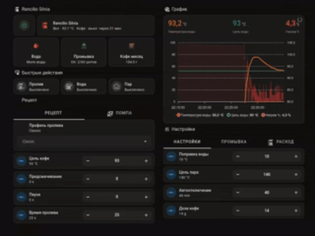

# Rancilio Silvia Controller

Умный контроллер для Rancilio Silvia на базе ESPHome: PID-контроль температуры, профили пролива, автоматическая промывка и панель Home Assistant.

[English version](README.md)

[Группа проекта в Telegram](https://t.me/Rancilio_Silvia) (русский и английский)

Цифровой контроллер кофемашины Rancilio Silvia на базе ESP32-S3, реализованный через ESPHome и интегрированный с Home Assistant.

Это не просто внешний PID-регулятор. Цель проекта - перевести логику управления кофемашиной на цифровой контроллер: высоковольтные нагрузки коммутируются через реле и SSR, а штатные органы управления становятся низковольтными GPIO-входами ESP32-S3. Машина управляется из Home Assistant, а в будущем вместо физических кнопок можно использовать дисплей или другой цифровой интерфейс.

> [!WARNING]
> В кофемашине присутствует опасное сетевое напряжение и горячий бойлер под давлением. ESPHome не заменяет штатный термостат, термопредохранитель, заземление и другие аппаратные защиты. Не работайте с подключённой к сети машиной.



https://github.com/user-attachments/assets/92bf4580-1ab9-4535-a1f1-395bb5a3d315

## Текущий статус

Контроллер уже работает на реальной Rancilio Silvia. Аппаратная часть пока собрана как прототип на ESP32-S3 dev board и точечном монтаже.

Сейчас реализовано:

- ESP32-S3 с ESP-IDF;
- интеграция с ESPHome и Home Assistant;
- измерение температуры бойлера через PT100 и MAX31865;
- PID-регулирование нагревателя через SSR;
- режимы `Brew` и `Steam`;
- автоматический пролив с профилями и предсмачиванием;
- замкнутое профилирование давления с цифровым I2C-датчиком XDB401;
- управление помпой через RobotDyn/Robotron AC dimmer и кастомный ESPHome-выход с пропуском полных периодов сети;
- управление горячей водой и режимом пара;
- вход датчика уровня воды;
- таймер автоотключения;
- счётчик шотов, напоминание о промывке и автоматическая программа backflush;
- настраиваемая доза кофе и расчётный расход сухого молотого кофе;
- PID autotune и автоматическое сохранение успешных коэффициентов;
- runtime-настройки регулятора давления (`Kp`/`Ki`), ручной мощности помпы, плавности переходов и опционального стартового пинка.

Автоматические рецепты теперь задают целевое давление. Контроллер измеряет фактическое давление, складывает рассчитанный по цели feed-forward с PI-коррекцией и обновляет команду помпы каждые `200 мс`. Ручное управление помпой остаётся open-loop командой мощности.

## Аппаратная часть

Основные компоненты текущего прототипа:

- ESP32-S3 dev board;
- трёхпроводной PT100;
- усилитель MAX31865;
- SSR для нагревателя бойлера;
- релейные выходы для питания машины, помпы и brew-клапана;
- вход RobotDyn/Robotron AC dimmer для экспериментального управления помпой;
- цифровой I2C-датчик давления XDB401 с диапазоном 0-1,2 МПа;
- низковольтные входы для штатных кнопок питания, пролива, горячей воды и пара;
- вход датчика уровня воды XKC-Y25-NPN.

Планируемое дополнение: собственная PCB с разъёмами для датчиков, реле и периферии.

## Возможности

### Температура и нагрев

- PID-регулирование нагревателя через ESPHome `climate`;
- отдельные цели для кофе и пара;
- настраиваемая поправка температуры приготовления, участвующая в PID-регулировании;
- исходная температура PT100 остаётся доступна отдельным сенсором;
- настройка `KP`, `KI`, `KD` из Home Assistant;
- статус PID autotune и автоматическое сохранение успешных коэффициентов;
- настраиваемая программная защита от перегрева;
- блокировка SSR при недостоверном показании PT100.

### Пролив

- автоматический пролив по таймеру;
- единые профили пролива: `Classic`, `Lever`, `Slayer Style`, `Bloom` и `Custom`;
- настраиваемое время/давление предсмачивания, soak-пауза, длительность основного пролива и кривая давления;
- живой статус фазы пролива с обратным отсчётом;
- замкнутые профили давления с публикацией цели и факта в Home Assistant;
- физический низковольтный вход для кнопки пролива;
- ручное управление реле помпы и brew-клапана.

### Вода, пар и питание

- управление силовым реле кофемашины;
- режим горячей воды;
- режим пара;
- физические низковольтные входы для горячей воды и пара;
- автоотключение по неактивности;
- сброс таймера автоотключения при проливе, горячей воде, паре, включении помпы и brew-клапана;
- статусный светодиод;
- контроль уровня воды и текстовый статус.

### Счётчики и обслуживание

- напоминание о промывке группы по количеству шотов;
- одно-кнопочная staged-программа backflush с химией, паузой на подготовку rinse и ополаскиванием чистой водой;
- ручная остановка промывки и сброс счётчика;
- общий счётчик шотов;
- настраиваемая сухая доза кофе на шот;
- расчётный общий расход сухого молотого кофе;
- учёт расхода кофе за месяц и год через Home Assistant utility meter.

## Структура репозитория

```text
.
├── README.md
├── README.ru.md
├── esphome/
│   ├── components/
│   │   └── ac_cycle_skip/
│   ├── rancilio-silvia-power.yaml
│   └── secrets.example.yaml
├── docs/
│   ├── home-assistant.md
│   ├── safety.md
│   └── wiring.md
└── images/
```

## Быстрый старт

1. Установите ESPHome или ESPHome Device Builder в Home Assistant.
2. Скопируйте `esphome/rancilio-silvia-power.yaml` и `esphome/components/ac_cycle_skip/` в каталог конфигурации ESPHome.
3. Создайте `secrets.yaml` по примеру `esphome/secrets.example.yaml`.
4. Проверьте назначение GPIO, схему и логику релейных модулей именно вашей сборки.
5. Выполните проверку конфигурации перед сборкой прошивки.
6. Первые тесты нагревателя, помпы и клапана проводите под постоянным наблюдением.

## Настройка в Home Assistant

Большая часть пользовательских параметров доступна как сущности Home Assistant. Значения в YAML - это начальные настройки, а не фиксированные характеристики машины.

Настраиваются:

- целевая температура кофе;
- целевая температура пара;
- поправка температуры приготовления;
- коэффициенты PID;
- профиль пролива;
- время работы помпы на предсмачивании;
- давление предсмачивания;
- пауза после предсмачивания;
- длительность основного пролива;
- основное и конечное давление;
- коэффициенты `Kp` и `Ki` регулятора давления;
- включение, мощность и длительность стартового boost pressure-профиля;
- длительность стартовой стабилизации pressure-профиля;
- ручная мощность помпы;
- плавность переходов мощности помпы;
- ручной стартовый пинок, boost для отдельных фаз и длительность пинка;
- порог напоминания о промывке;
- пауза на подготовку rinse перед ополаскиванием;
- сухая доза кофе на шот;
- время автоотключения.

### Пролив и профили

`Silvia Brew Shot` запускает автоматическую последовательность:

1. открыть brew-клапан;
2. при необходимости включить помпу для предсмачивания;
3. при необходимости выдержать паузу после предсмачивания;
4. включить помпу на заданное время основного пролива;
5. выключить помпу и закрыть brew-клапан.

`Silvia Shot Profile` теперь единственный выбор рецепта пролива. Он задаёт предсмачивание, soak-паузу, длительность основного пролива и замкнутую кривую давления:

- `Classic`: без предсмачивания и паузы, ровная цель рабочего давления;
- `Lever`: предсмачивание на низком давлении, плавный подъём к рабочему давлению и постепенное снижение к концу;
- `Slayer Style`: длинное предсмачивание на низком давлении и более мягкая основная кривая;
- `Bloom`: смачивание на низком давлении, настоящая пауза с выключенной помпой и плавный выход на основное давление;
- `Custom`: редактируемые времена фаз и кривая `Custom Start/Main/End Pressure`.

Ручное изменение времени, custom-давления фазы или phase boost автоматически переводит профиль в `Custom`. `Silvia Manual Pump Power` отделён от рецепта и используется только для ручного включения помпы, горячей воды и обслуживания.

`Silvia Brew Shot Status` показывает текущую фазу автоматического пролива и обратный отсчёт:

- `Предсмачивание`: оставшееся время работы помпы для предсмачивания;
- `Пауза`: оставшееся время паузы после предсмачивания;
- `Пролив`: оставшееся время основного пролива;
- `Ожидание`: автоматический пролив не выполняется.

Панель Home Assistant может использовать этот статус как основной живой таймер пролива, не пытаясь угадывать фазу по времени изменения сущностей.

Автоматические профили делают snapshot выбранного рецепта на старте шота, включая времена фаз, цели давления, boost-флаги фаз и `Silvia Pump Start Boost Time`. Snapshot разворачивается в явные `ShotPhase` и обновляет цель и рассчитанную мощность каждые `200 мс`. Изменения в Home Assistant во время пролива применятся к следующему шоту, а не к текущему. После остановки или отмены пролива пользовательские `Silvia Pump Ramp Time` и ручной boost восстанавливаются.

В фазах давления команда помпы рассчитывается как feed-forward по текущей цели плюс PI-коррекция. Интеграл ограничен диапазоном `+-0,35`, сбрасывается на границе каждой фазы или при недостоверном показании датчика и использует conditional anti-windup: он не накапливается дальше при насыщении выхода на `0%` или `100%`, но может выйти из насыщения после смены знака ошибки. `Silvia Pressure Control Kp` и `Silvia Pressure Control Ki` регулируются из Home Assistant. Цель публикуется как `Silvia Target Brew Pressure`, факт XDB401 — как `Silvia Brew Pressure`. Устаревшее или недостоверное показание давления принудительно обнуляет автоматическую команду помпы.

Для автоматических pressure-профилей предусмотрен отдельный, по умолчанию выключенный `Silvia Pressure Profile Startup Boost`. Его мощность (`0-100%`) и длительность (`0-500 мс`) по умолчанию равны `100%` и `100 мс`. Настройки фиксируются в snapshot при запуске шота, а временное переопределение выхода однократно использует первая работающая `PRESSURE`-фаза. Клапан, таймер профиля и таймер фазы запускаются как обычно: boost идёт внутри уже отсчитываемого времени, не добавляет отдельную фазу и не удлиняет пролив. Во время override интегратор PI заморожен, после чего выход сразу возвращается к текущей команде регулятора давления.

`Silvia Pressure Profile Startup Settling Time` по умолчанию равен `400 мс` и регулируется от `0` (выключено) до `1000 мс`. Окно стабилизации начинается сразу после открытия brew-клапана и входит в обычное время профиля. В этот период контроллер игнорирует ошибку давления, удерживает интеграл на нуле и подаёт на помпу feed-forward, рассчитанный по текущей цели профиля. Это даёт остаточному давлению перед клапаном и сглаженному показанию датчика время стабилизироваться до включения PI. Если экспериментальный timed boost включён, он временно имеет приоритет над feed-forward, не удлиняя settling.

В текущей реализации brew-клапан открывается до старта автоматического профиля. Предварительное нагнетание при закрытом клапане и адаптивный старт по скорости роста давления пока рассматриваются как варианты и в рабочий алгоритм не включены.

`Silvia Manual Pump Power` регулируется от `0%` до `100%`. `Silvia Pump Start Boost` остаётся ручным boost для обычного включения помпы. Старые `Silvia Preinfusion Boost` и `Silvia Main Brew Boost` применяются только к open-loop фазам `POWER`; фазы `PRESSURE` используют отдельный pressure-profile startup boost, поэтому два механизма не могут наложиться. `Silvia Pump Gate Delay` и `Silvia Pump Gate Pulse` настраивают момент и длительность импульса TRIAC в микросекундах.

### AC Cycle Skip для помпы

Для диммера помпы используется локальный ESPHome external component в `esphome/components/ac_cycle_skip/`. Это не обычный phase-angle dimmer. Обычный диммер режет каждую полуволну сети; на малых процентах помпа получает слабые обрезанные куски синуса и может просто гудеть.

Пример примерно на `30%`:

```text
phase-angle dimmer:
  каждая полуволна обрезана и слабая
  ~~~/    ~~~/    ~~~/    ~~~/

ac_cycle_skip:
  полные периоды сети проходят или пропускаются
  ON период -> пропуск -> пропуск -> ON период -> пропуск -> пропуск
```

Компонент держит дробный аккумулятор, поэтому малые проценты распределяются по времени, а не отправляются одним комком. Когда цель меняется, внутренняя мощность постепенно движется к новой цели за время `ramp_ms`.

Пример перехода с `30%` на `80%` при `ramp_ms: 800`:

```text
запрошено: 30% ----------------------> 80%
внутри:    30% -> 38% -> 46% -> 54% -> 62% -> 70% -> 80%
выход:     редкие полные периоды постепенно становятся плотнее
```

Код профиля пролива обновляет запрошенную мощность во время шота, а `ac_cycle_skip` сглаживает электрический выход между этими значениями. Так помпа меняется менее резко, но выход остаётся синхронизированным с zero-cross.

Gate timing и safety-детали:

- GPIO zero-cross ISR больше не ждёт `gate_pulse_us` через busy-wait;
- импульс gate планируется через ESP-IDF GPTimer с частотой 1 MHz;
- GPTimer ISR/cache safety включён через ESP-IDF sdkconfig options: `CONFIG_GPTIMER_ISR_CACHE_SAFE`, `CONFIG_GPTIMER_CTRL_FUNC_IN_IRAM` и `CONFIG_GPTIMER_ISR_HANDLER_IN_IRAM`;
- `gate_delay_us` задаёт короткую паузу после zero-cross перед включением gate, а `gate_pulse_us` задаёт длительность импульса;
- дефолтные значения: `gate_delay_us: 100` и `gate_pulse_us: 300`, а задержку нельзя поставить ниже `10 us`;
- runtime-тайминги читаются атомарно, а generation guard не даёт старому timer callback поднять gate после команды OFF;
- `write_state(0)` и shutdown компонента сразу переводят gate pin в LOW;
- интервалы zero-cross вне допустимого окна принудительно выключают выход и запускают ресинхронизацию;
- после ошибки синхронизации компонент ждёт несколько последовательных валидных zero-cross интервалов перед возобновлением выхода.

### Расход кофе

`Silvia Coffee Dose Grams` хранит сухую дозу кофе на один шот. По умолчанию используется `14 г`, значение можно менять из Home Assistant.

`Silvia Coffee Grounds Used` оценивает общий расход сухого молотого кофе:

```text
Расход молотого кофе = Silvia Lifetime Shots × Silvia Coffee Dose Grams
```

Это оценка расхода молотого кофе, а не вес напитка в чашке.

Home Assistant может разбивать это накопительное значение на календарные периоды через `utility_meter`:

- `coffee_grounds_used_monthly` — расход за текущий месяц;
- `coffee_grounds_used_yearly` — расход за текущий год;
- `Silvia Coffee Grounds Used` остаётся общим расходом за всё время.

В кофейной панели выводятся все три значения: месяц, год и всего.

### Промывка группы

`Silvia Backflush Shots` считает завершённые автоматические проливы с последней промывки группы. `Silvia Lifetime Shots` хранит общий счётчик шотов и не сбрасывается при промывке.

`Silvia Backflush Reminder Shots` задаёт порог напоминания. По умолчанию это `60` шотов. Значение `0` отключает напоминание. Когда счётчик доходит до порога, `Silvia Backflush Status` показывает, что пора промыть группу. Это только напоминание, оно не блокирует приготовление кофе.

`Silvia Start Backflush` запускает одно-кнопочную staged-программу промывки для слепого фильтра:

1. Фаза с химией: `8` циклов по `5 с` работы помпы/клапана и `10 с` паузы.
2. Пауза на подготовку rinse: машина останавливается, а `Silvia Backflush Status` показывает обратный отсчёт `Prepare rinse | N s`. За это время нужно снять холдер, смыть химию, промыть слепой фильтр, при необходимости слить воду из поддона и поставить чистый слепой фильтр обратно.
3. Ополаскивание чистой водой: ещё `8` циклов по `5 с` работы и `10 с` паузы, уже без порошка/таблетки.

`Silvia Backflush Rinse Delay Seconds` задаёт паузу между химической фазой и ополаскиванием. По умолчанию это `120 с`, значение можно менять из Home Assistant.

Во время программы `Silvia Backflush Status` показывает `Cleaning | N/8 cycles`, `Prepare rinse | N s` и `Rinsing | N/8 cycles`. Счётчик шотов после промывки сбрасывается только после полного завершения ополаскивания.

`Silvia Stop Backflush` прерывает программу и выключает помпу с клапаном. `Silvia Reset Backflush Shots` вручную сбрасывает счётчик напоминания.

Рекомендуемый порядок:

1. Прогреть машину, поставить слепой фильтр, добавить средство для backflush и нажать `Silvia Start Backflush`.
2. Дождаться окончания первой фазы, когда статус сменится на `Prepare rinse | N s`.
3. Во время обратного отсчёта снять холдер, смыть химию, промыть холдер и слепой фильтр, а также слить воду из поддона, если он наполнился.
4. До конца отсчёта поставить обратно чистый слепой фильтр уже без порошка/таблетки.
5. Дождаться завершения ополаскивания чистой водой. После этого счётчик напоминания о промывке сбросится.

### Модель температуры приготовления

`Silvia Brew Target` задаёт желаемую расчётную температуру воды у кофейной таблетки. В режиме `Brew` PID работает по формулам:

```text
Расчётная температура приготовления = температура PT100 - поправка
Цель бойлера = Brew Target + поправка
```

Например, при цели приготовления `93 °C` и поправке `10 °C` расчётная цель бойлера будет примерно `103 °C`.

Сенсор PT100 всегда показывает исходную температуру бойлера. В режиме `Steam` поправка не применяется, а программная защита от перегрева всегда работает по исходному показанию PT100.

Расчётная температура не является прямым измерением воды. До калибровки у группы при нормальном расходе оставьте поправку равной `0 °C`.

## План развития

- Добавить цифровой I2C-датчик давления для измерения brew pressure.
- Использовать обратную связь по давлению для замкнутого профилирования.
- Обновить панель Home Assistant графиками давления.
- Разработать собственную PCB с нормальными разъёмами.
- Расширить документацию по подключению и Home Assistant.

## Документация

- [Подключение и GPIO](docs/wiring.md)
- [Home Assistant](docs/home-assistant.md)
- [Безопасность](docs/safety.md)

## Лицензия

Проект пока опубликован без лицензии. Все права сохраняются за автором.
